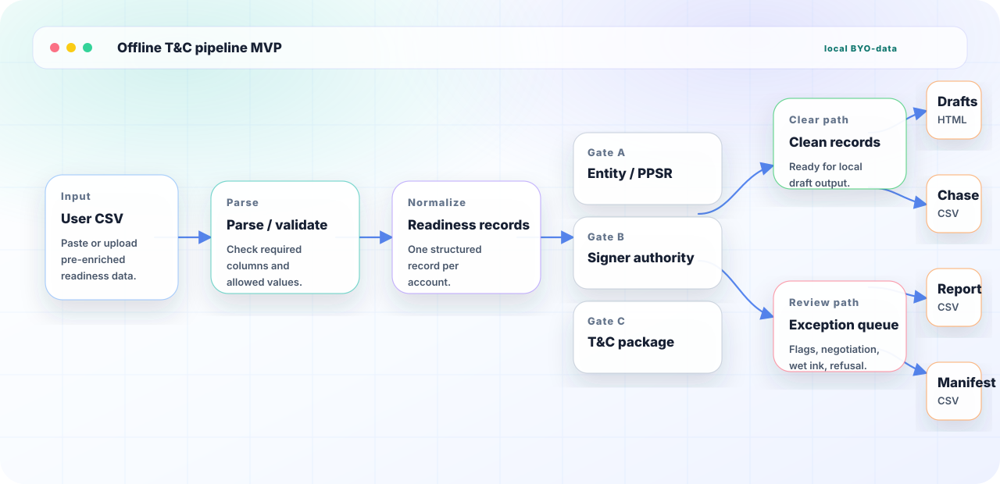

# Offline T&C Pipeline MVP

A local, bring-your-own-data MVP for the Legal Quants residency T&C / e-sign challenge.

The thesis is simple: the useful answer is not a bulk sender. It is a judgment-led remediation campaign that validates readiness data, runs deterministic gates, and moves every account to an owned final state: signed and evidenced, negotiation, wet-ink / counsel path, credit-stop review, chase, or residual human review.



## What This Is

This is an offline BYO-data MVP. It runs in the browser on local CSV content that you paste or upload. The bundled example records are synthetic and exist only to show the workflow before you bring your own readiness CSV.

The CSV must already be enriched with the gate facts this app evaluates. This repo does not independently verify NZBN status, PPSR debtor match, signer authority, email confidence, or collateral-clause approval.

The app parses and validates CSV rows before gate evaluation, shows gate findings and final dispositions, and generates downloadable local artifacts from the evaluated records:

- Prefilled synthetic T&C draft HTML files for clean in-chase records.
- A chase tracker CSV.
- An exception report CSV.
- An evidence manifest CSV.

## What This Is Not

This is not a live sender. It does not send envelopes, messages, emails, notices, or customer communications.

It does not connect to Miseiri, PPSR, DocuSign, email, NZBN, or any customer system. It makes no network calls for customer data. Sample data is synthetic and should not be treated as real customer data or legal terms.

Nothing here is legal advice, a production workflow, or a counsel-approved T&C template.

For the concrete gap between this offline MVP and a real 230-customer production pipeline, see [`REAL_IMPLEMENTATION_REQUIREMENTS.md`](REAL_IMPLEMENTATION_REQUIREMENTS.md).

## Run Locally

```bash
npm install
npm test
npm run build
npm run dev
```

## CSV Input

The local CSV must include these columns:

`customer_id,trading_name,legal_name,nzbn,ppsr_registration_number,exposure_band,signer_name,signer_role,signer_email,authority_evidence,template_version,coverage,e_sign_eligible,entity_status,ppsr_debtor_matches,email_confidence,collateral_clause_approved,customer_response`

Optional columns (legal-soundness fix — supply when enrichment is available; gates treat missing values as unknown and flag for review):

`debtor_type,incorporation_number,legal_name_verified,insolvency_risk,related_party,legacy_balance_nzd,will_extend_new_credit,new_credit_limit_nzd,restricted_period_indicator,commercially_worth_remediating,residual_risk_approved_by,annual_contract_value_nzd,has_personal_guarantee,guarantor_name,guarantor_email,ppsr_correction_type,security_agreement_status`

Allowed values are enforced by the parser before any gate evaluation runs.

## Pipeline

`User CSV -> parse/validate -> readiness records -> gates -> clean records / exception queue -> prefilled drafts / chase tracker / exception report / evidence manifest`

The checked-in diagram lives at `docs/pipeline.svg`.

### Legal framing

A validly signed security agreement makes the interest **enforceable against third parties and a liquidator** (PPSA s 36). It does **not** make the charge **clawback-proof** in insolvency. Companies Act ss 292–293 can still void or set aside a charge given for antecedent debt during the restricted period. Gates D and E encode that distinction.

### Gates

| Gate | Question | Auto-clear when | Flag for human review when |
|------|----------|-----------------|------------------------------|
| **A — Entity / PPSR** | Are we asking the right legal debtor, and does PPSR match? | NZBN present, entity active, PPSR debtor matches | Missing NZBN, inactive entity, PPSR mismatch or unknown match |
| **A+ — Capacity** (extends A) | Is the debtor type and s 142 identity verified? | Company debtor, legal name verified, incorporation number present | Trust, partnership, sole trader, or unknown debtor type; legal name not verified; incorporation number missing |
| **B — Signer Authority** | Can this person bind the debtor, and is delivery reliable? | Signer identified, authority evidence present, verified email | Missing signer/role, weak authority for material accounts, unverified email |
| **C — T&C Package** | Is the envelope content and e-sign route correct? | Approved template, collateral clause approved, e-sign eligible | Missing template, unapproved collateral, counsel-review coverage, e-sign ineligible |
| **D — Insolvency / Clawback** | Does this account carry voidable-charge or preference risk? | Low insolvency risk, future-and-existing coverage, unrelated party | Elevated insolvency risk + existing-only or future-and-existing coverage (antecedent-debt clawback); related-party charge; elevated insolvency alone |
| **E — Guarantee / FTA** | Are guarantee formalities and unfair-terms exposure handled? | No personal guarantee, or guarantor captured separately; contract ≥ $250k/yr | Personal guarantee without separate guarantor signer; sub-$250k annual contract value (FTA specified-trade-contract screen) |

**Gate D finding codes:** `ANTECEDENT_DEBT_CLAWBACK_RISK`, `RELATED_PARTY_CHARGE_RISK`, `INSOLVENCY_RISK_ELEVATED`

**Gate E finding codes:** `PERSONAL_GUARANTEE_REQUIRES_SEPARATE_SIGNER`, `GUARANTOR_MISSING`, `FTA_UNFAIR_TERMS_REVIEW`

**Gate A+ finding codes:** `DEBTOR_TYPE_REQUIRES_HUMAN_REVIEW`, `LEGAL_NAME_NOT_VERIFIED`, `INCORPORATION_NUMBER_MISSING`

**PPSR close-loop (Gate A):** `PPSR_UNSUPPORTED_REGISTRATION` (unsigned security agreement + existing registration — s 162(d) demand-contingent exposure; prioritise signature chase by competitive/insolvency exposure); `PPSR_WRONG_ENTITY_REREGISTER` (wrong legal entity → re-register, priority resets per ss 41/66; trivial typo on valid registration → amend, priority preserved)

**Gate D+ remediation router:** After Gate D detection, `resolveInsolvencyRemediation()` selects a clawback-mitigation path (`future-supply-only`, `new-value-contemporaneous`, `credit-stop`, etc.). Elevated insolvency with antecedent-debt coverage routes to `in-chase` with a remediation template when facts are complete — not a blind `human-review` dead-end. See `research/lq-residency/230-tc-esign-insolvency-survival-design.md`.

**Disposition rules (Gate D/E):** related-party and unknown load-bearing insolvency fields still route to `human-review`; wrong-entity PPSR correction routes to `human-review` with re-register action.

## Tech Stack

- Vite
- React
- TypeScript
- Vitest
